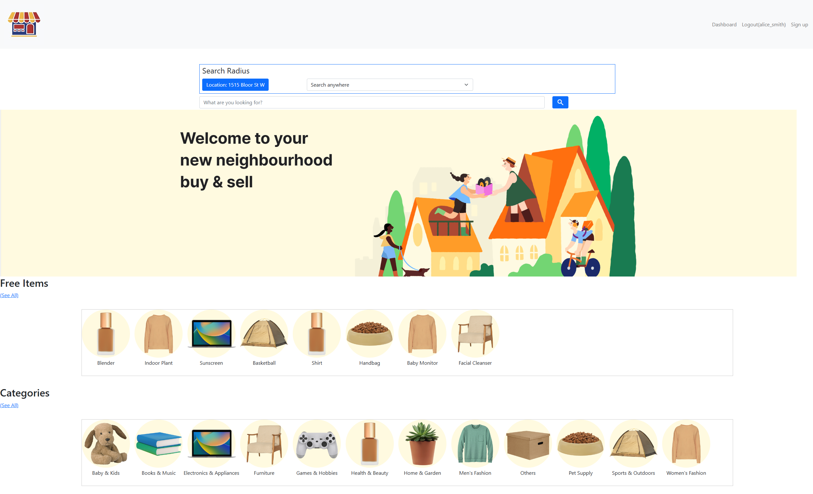

# marketplace

Resale app with built-in location search for finding nearby treasures.

## Install

1. Install PostGIS
2. Set DB credentials in a .env file with the structure similar to .env.EXAMPLE file.
3. Run

```sh
npm install
```

3. Run /db/schema.sql in psql shell
4. Seed DB by running

```sh
npm run seed
```

## Usage

Visit [website](https://marketplace-3v8k.onrender.com/)



## Credit

1. Ehsan Hosseini
2. Ryan Cuthbert
3. Jhonalyn Golo
4. Mariam
5. shayna sammy
